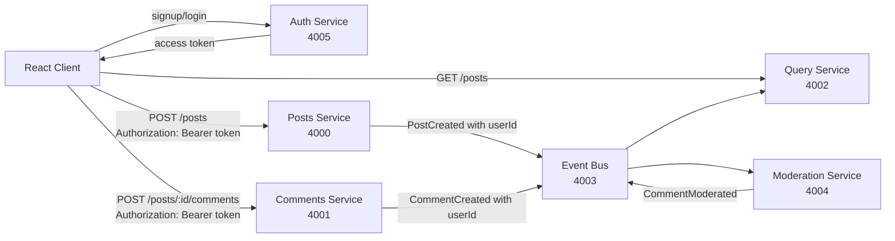
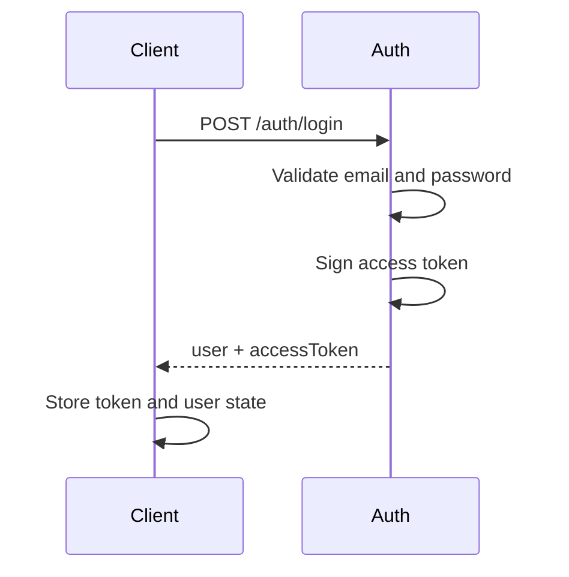
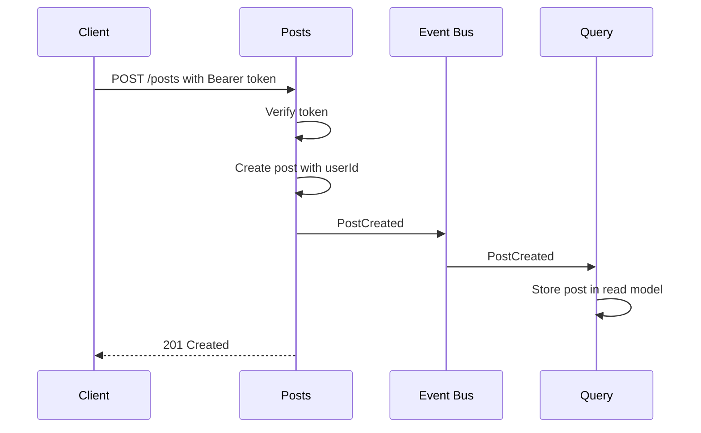
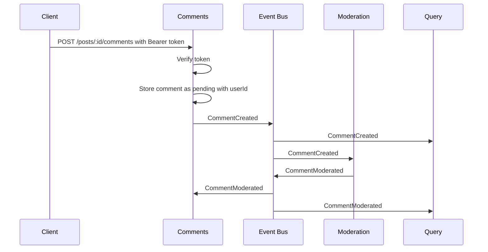

# Authentication and Authorization Design

## Goal

Add authentication and authorization to the blog microservice app without breaking the event-driven architecture.

The goal is:

- Users can sign up and log in.
- Only authenticated users can create posts and comments.
- Users can only edit or delete their own content, if those features are added later.
- Admin users can moderate or manage content.
- Services stay decoupled.
- Events carry identity data, not passwords or tokens.

This document describes the recommended design, how it works, what to implement, and the trade-offs.

---

## Current Architecture Summary

The app currently has these services:

| Service | Port | Responsibility |
| --- | --- | --- |
| Client | 5173 | React UI |
| Posts | 4000 | Creates and stores posts |
| Comments | 4001 | Creates and stores comments |
| Query | 4002 | Builds the read model for the UI |
| Event Bus | 4003 | Broadcasts events between services |
| Moderation | 4004 | Decides whether comments are accepted or rejected |

The important architectural rule is:

> Write services emit events. Query service listens to events and builds a read model.

Authentication should fit into that model. It should not make every service call every other service on every request.

---

## Recommended Approach

Add a new **Auth service**.

```txt
auth/
  index.js
  package.json
```

Suggested port:

```txt
Auth Service: 4005
```

The Auth service owns:

- User registration
- Login
- Password hashing
- Token issuing
- User roles

The other services do not store passwords and do not validate credentials. They only verify the token sent by the client.

---

## High-Level Architecture



### What the Boxes Mean

- **Client**: stores the login state and sends the access token with protected requests.
- **Auth service**: verifies credentials and creates signed tokens.
- **Posts service**: verifies the token before creating a post.
- **Comments service**: verifies the token before creating a comment.
- **Query service**: serves the read model. Public reads can remain unauthenticated at first.
- **Event bus**: broadcasts domain events. It should not perform user login logic.
- **Moderation service**: moderates comments based on events.

### What the Arrows Mean

- Client logs in through Auth.
- Auth returns a token.
- Client sends that token to services that require authentication.
- Services emit events that include user identity fields such as `userId` and `username`.
- Query service uses those events to build UI-friendly data.

---

## Authentication vs Authorization

These are different ideas.

### Authentication

Authentication answers:

> Who are you?

Example:

```txt
User logs in with email and password.
Auth service returns a signed token.
```

### Authorization

Authorization answers:

> Are you allowed to do this action?

Example:

```txt
A normal user can create comments.
Only an admin can manually approve rejected comments.
Only the post owner can edit their post.
```

Do not mix these concepts. First verify the user. Then check what that user is allowed to do.

---

## Token Strategy

Use a signed access token.

For this project, the simplest practical option is a JWT.

Example token payload:

```json
{
  "sub": "user-123",
  "email": "sara@example.com",
  "username": "sara",
  "role": "user",
  "iat": 1710000000,
  "exp": 1710000900
}
```

Important fields:

| Field | Meaning |
| --- | --- |
| `sub` | User ID |
| `email` | User email |
| `username` | Display name |
| `role` | User role, for example `user` or `admin` |
| `exp` | Expiration time |

Use short-lived access tokens. A good learning-project value is:

```txt
15 minutes
```

For a production system, add refresh tokens later. Do not start there unless you need persistent sessions.

---

## Password Storage

Never store plain text passwords.

The Auth service should store:

```js
{
  id: "user-123",
  email: "sara@example.com",
  username: "sara",
  passwordHash: "...",
  role: "user"
}
```

Use `bcrypt` to hash passwords.

Recommended dependency:

```bash
npm install bcrypt jsonwebtoken
```

For this project, users can start in memory, just like posts and comments. Later, move users to a database.

---

## Auth Service API

### `POST /auth/signup`

Creates a new user.

Request:

```json
{
  "email": "sara@example.com",
  "username": "sara",
  "password": "strong-password"
}
```

Response:

```json
{
  "user": {
    "id": "user-123",
    "email": "sara@example.com",
    "username": "sara",
    "role": "user"
  },
  "accessToken": "jwt-token-here"
}
```

Validation rules:

- Email is required.
- Username is required.
- Password is required.
- Email must be unique.
- Password should have a minimum length.

### `POST /auth/login`

Logs in an existing user.

Request:

```json
{
  "email": "sara@example.com",
  "password": "strong-password"
}
```

Response:

```json
{
  "user": {
    "id": "user-123",
    "email": "sara@example.com",
    "username": "sara",
    "role": "user"
  },
  "accessToken": "jwt-token-here"
}
```

### `GET /auth/me`

Returns the currently authenticated user.

Request header:

```txt
Authorization: Bearer jwt-token-here
```

Response:

```json
{
  "id": "user-123",
  "email": "sara@example.com",
  "username": "sara",
  "role": "user"
}
```

---

## Shared Auth Middleware

Posts and Comments need the same token verification logic.

At this project size, create a tiny shared helper in each service first. Later, extract it into a shared package if duplication becomes painful.

Example middleware:

```js
import jwt from "jsonwebtoken";

const JWT_SECRET = process.env.JWT_SECRET || "dev-secret";

export const requireAuth = (req, res, next) => {
  const authorization = req.headers.authorization;

  if (!authorization?.startsWith("Bearer ")) {
    return res.status(401).send({ error: "Authentication required" });
  }

  const token = authorization.replace("Bearer ", "");

  try {
    req.user = jwt.verify(token, JWT_SECRET);
    next();
  } catch {
    return res.status(401).send({ error: "Invalid or expired token" });
  }
};
```

Then protect write endpoints:

```js
app.post("/posts", requireAuth, async (req, res) => {
  const post = {
    id: randomUUID(),
    title,
    userId: req.user.sub,
    username: req.user.username,
  };

  // store and emit PostCreated
});
```

```js
app.post("/posts/:id/comments", requireAuth, async (req, res) => {
  const comment = {
    id: randomUUID(),
    postId,
    content,
    status: "pending",
    userId: req.user.sub,
    username: req.user.username,
  };

  // store and emit CommentCreated
});
```

---

## Event Changes

Events should include the user identity needed by downstream services.

Do not put the full token in events.

Do not put password data in events.

### `PostCreated`

Current shape:

```json
{
  "type": "PostCreated",
  "data": {
    "id": "post-123",
    "title": "Hello"
  }
}
```

Recommended shape:

```json
{
  "type": "PostCreated",
  "data": {
    "id": "post-123",
    "title": "Hello",
    "userId": "user-123",
    "username": "sara"
  }
}
```

### `CommentCreated`

Recommended shape:

```json
{
  "type": "CommentCreated",
  "data": {
    "id": "comment-123",
    "postId": "post-123",
    "content": "Nice post",
    "status": "pending",
    "userId": "user-123",
    "username": "sara"
  }
}
```

### `CommentModerated`

This event does not need user identity for the first version:

```json
{
  "type": "CommentModerated",
  "data": {
    "id": "comment-123",
    "postId": "post-123",
    "status": "accepted"
  }
}
```

If you later need an audit trail, add:

```json
{
  "moderatedBy": "system"
}
```

---

## Query Service Changes

The Query service should store the author information from events.

Example read model:

```js
posts[postId] = {
  id: postId,
  title,
  userId,
  username,
  comments: [
    {
      id,
      content,
      status,
      userId,
      username,
    },
  ],
};
```

The client can then display:

```txt
Post title
by sara

Comment
by sara
```

For rejected comments, keep following the rule already implemented:

```txt
Display "Comment rejected"
Do not display the rejected content
```

---

## Authorization Rules

Start with simple rules.

| Action | Required User |
| --- | --- |
| View posts | Anyone |
| Create post | Authenticated user |
| Create comment | Authenticated user |
| View comments | Anyone |
| Edit own post | Post owner |
| Delete own post | Post owner or admin |
| Delete comment | Comment owner or admin |
| Manually approve comment | Admin |

Do not implement admin workflows until the basic user authentication flow is stable.

---

## Request Flow: Login



### Explanation

The Auth service is the only service that checks passwords.

The token is proof that the user already authenticated. Other services verify the signature instead of asking Auth on every request.

---

## Request Flow: Create Post



### Explanation

The Posts service owns post creation. Auth only proves who the user is.

The event includes the user ID so Query can build a useful read model.

---

## Request Flow: Create Comment



### Explanation

The Comments service decides whether the request is allowed.

The Moderation service decides whether the content is acceptable.

Those are separate responsibilities:

- Auth: who is making the request?
- Comments: can this user create a comment?
- Moderation: should this content be accepted?
- Query: what should the UI read?

---

## Client Changes

The client needs:

- Signup form
- Login form
- Logout button
- Auth state
- Token attached to protected requests

Suggested client state:

```js
const [user, setUser] = useState(null);
const [accessToken, setAccessToken] = useState(null);
```

For this learning project, local storage is acceptable:

```js
localStorage.setItem("accessToken", accessToken);
```

Production note:

> Browser local storage is vulnerable if your app has an XSS bug. For production, prefer secure, HttpOnly cookies with CSRF protection, or a more complete token strategy.

When creating a post:

```js
await fetch("http://localhost:4000/posts", {
  method: "POST",
  headers: {
    "Content-Type": "application/json",
    Authorization: `Bearer ${accessToken}`,
  },
  body: JSON.stringify({ title }),
});
```

When creating a comment:

```js
await fetch(`http://localhost:4001/posts/${postId}/comments`, {
  method: "POST",
  headers: {
    "Content-Type": "application/json",
    Authorization: `Bearer ${accessToken}`,
  },
  body: JSON.stringify({ content }),
});
```

The UI should hide or disable create forms when the user is logged out.

Do not rely only on hiding buttons. The backend must still enforce authentication.

---

## Environment Variables

Use the same JWT secret in Auth, Posts, and Comments.

For local development:

```txt
JWT_SECRET=replace-this-dev-secret
```

Services that need it:

| Service | Needs `JWT_SECRET` | Why |
| --- | --- | --- |
| Auth | Yes | Signs tokens |
| Posts | Yes | Verifies tokens |
| Comments | Yes | Verifies tokens |
| Query | Usually no | Public reads |
| Moderation | No | Receives identity from events |
| Event Bus | No for first version | Only routes events |

If you later protect admin read endpoints, Query may also need token verification.

---

## Suggested Implementation Order

### Step 1: Add Auth Service

Create:

```txt
auth/index.js
auth/package.json
auth/package-lock.json
```

Install:

```bash
cd auth
npm install express cors bcrypt jsonwebtoken nodemon
```

Implement:

- `POST /auth/signup`
- `POST /auth/login`
- `GET /auth/me`

Use in-memory users first:

```js
const usersByEmail = {};
```

### Step 2: Add Token Middleware to Posts

Add `jsonwebtoken`.

Protect:

```txt
POST /posts
```

Add author fields to posts:

```js
userId: req.user.sub,
username: req.user.username,
```

Emit those fields in `PostCreated`.

### Step 3: Add Token Middleware to Comments

Add `jsonwebtoken`.

Protect:

```txt
POST /posts/:id/comments
```

Add author fields to comments:

```js
userId: req.user.sub,
username: req.user.username,
```

Emit those fields in `CommentCreated`.

### Step 4: Update Query Service

Store `userId` and `username` from `PostCreated` and `CommentCreated`.

No password or token should ever appear here.

### Step 5: Update Client

Add:

- Login form
- Signup form
- Logout button
- Authenticated request headers
- Conditional rendering for create forms

### Step 6: Add Authorization Checks for Future Mutations

When adding edit/delete features, check ownership in the relevant command service.

Example:

```js
if (post.userId !== req.user.sub && req.user.role !== "admin") {
  return res.status(403).send({ error: "Not allowed" });
}
```

---

## Why Not Put Auth in the Event Bus?

The Event Bus should route events. It should not own user login, passwords, or business authorization.

Putting auth in the Event Bus would make it a central dependency for too many responsibilities:

- Routing
- Login
- Permissions
- Security policy

That makes the system harder to reason about.

Keep the Event Bus boring.

---

## Why Not Ask Auth Service on Every Request?

You could make Posts and Comments call Auth on every request:

```txt
Posts -> Auth -> "is this token valid?"
```

That is simple conceptually, but weak operationally:

- Auth becomes a bottleneck.
- If Auth is down, all writes fail.
- Every request adds network latency.
- Services become more tightly coupled.

Signed tokens avoid that. Services verify the token locally.

---

## Security Notes

For this project:

- Hash passwords with bcrypt.
- Use short-lived JWTs.
- Keep `JWT_SECRET` out of source code.
- Never send password hashes to the client.
- Never put tokens in events.
- Validate request bodies.
- Return generic login errors like `Invalid email or password`.

For production later:

- Use a real database.
- Use HTTPS.
- Add refresh token rotation.
- Prefer HttpOnly cookies for browser sessions.
- Add rate limiting on login.
- Add account lockout or abuse protection.
- Use asymmetric JWT signing if many services need verification.
- Protect internal service-to-service traffic.

---

## Testing Plan

### Auth Service Tests

Test:

- Signup creates a user.
- Duplicate email is rejected.
- Login succeeds with correct password.
- Login fails with wrong password.
- `/auth/me` rejects missing tokens.
- `/auth/me` accepts valid tokens.

### Posts Service Tests

Test:

- `POST /posts` rejects missing token.
- `POST /posts` rejects invalid token.
- `POST /posts` creates a post with valid token.
- `PostCreated` includes `userId` and `username`.

### Comments Service Tests

Test:

- `POST /posts/:id/comments` rejects missing token.
- Valid token creates pending comment.
- `CommentCreated` includes author fields.

### Integration Test

Manual flow:

```txt
1. Start Auth, Event Bus, Posts, Comments, Query, Moderation, Client.
2. Sign up.
3. Create a post.
4. Create a comment.
5. Create a comment containing "stupid".
6. Confirm accepted comments show content.
7. Confirm rejected comments show "Comment rejected".
8. Confirm Query service includes author data.
```

---

## Final Recommendation

Implement auth in this order:

1. Add `auth` service on port `4005`.
2. Use bcrypt for password hashing.
3. Use JWT access tokens for authentication.
4. Protect write endpoints in Posts and Comments.
5. Add `userId`, `username`, and `role` to token payloads.
6. Include `userId` and `username` in domain events.
7. Let Query store author data from events.
8. Add ownership checks only when edit/delete features exist.

This keeps the architecture clean:

- Auth service owns identity.
- Command services enforce write permissions.
- Event bus only routes events.
- Query service only builds the read model.
- Client handles login state and sends tokens.
