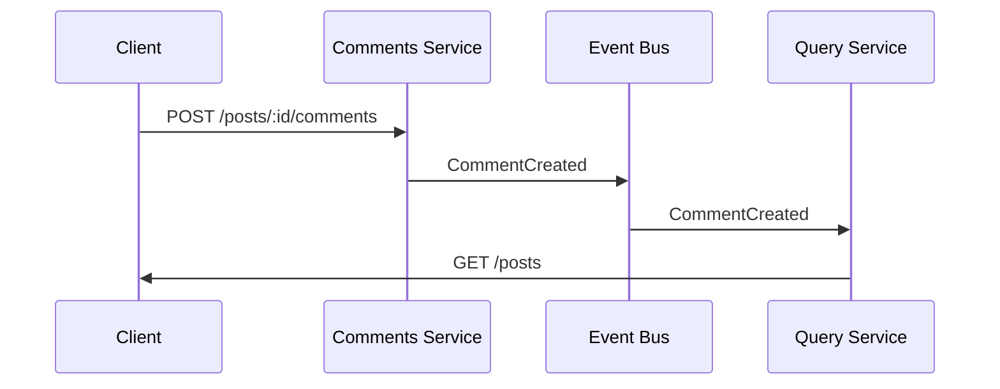
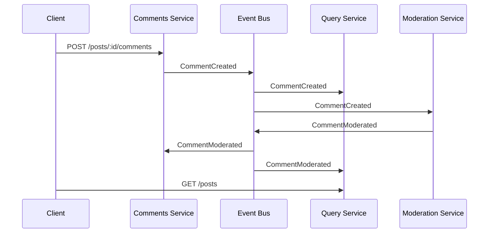

# Comment Moderation Design

## Goal

Add moderation so comments containing `"stupid"` are rejected.

A comment should have one of these states:

```js
"pending" | "accepted" | "rejected"
```

In the current architecture, the right place to think about this is the event flow:



Right now, comments are created and immediately treated as normal comments. To add moderation, we need a step that decides whether the comment is accepted or rejected.

## Solution 1: Moderate Inside Comments Service

When the client sends a comment, the Comments service checks the content immediately.

Example logic:

```js
const status = content.includes("stupid") ? "rejected" : "accepted";

const comment = {
  id: randomUUID(),
  postId,
  content,
  status,
};
```

Then it emits:

```js
{
  type: "CommentCreated",
  data: comment
}
```

The Query service stores the comment with that status.

### Pros

- Very simple.
- Fewest moving parts.
- Easy to understand.
- Good for a small learning project.
- No new service needed.

### Cons

- The Comments service now owns moderation logic.
- If moderation becomes more complex later, the Comments service can become messy.
- The event name `CommentCreated` becomes slightly misleading because moderation already happened.

This is the simplest solution, but it is less faithful to an event-driven microservice design.

## Solution 2: Add a Moderation Service

Add a new service, for example:

```txt
moderation/
  index.js
```

The flow becomes:



The Comments service creates every new comment as:

```js
{
  id,
  postId,
  content,
  status: "pending"
}
```

Then it emits:

```js
{
  type: "CommentCreated",
  data: comment
}
```

The Moderation service receives `CommentCreated`, checks the content, and emits:

```js
{
  type: "CommentModerated",
  data: {
    id,
    postId,
    status: "rejected"
  }
}
```

or:

```js
{
  type: "CommentModerated",
  data: {
    id,
    postId,
    status: "accepted"
  }
}
```

Then:

- Comments service updates its local comment status.
- Query service updates the read model.
- Client displays accepted, rejected, or pending comments.

### Pros

- Best match for the event-driven architecture.
- Clean separation of responsibilities.
- Comments service creates comments.
- Moderation service moderates comments.
- Query service builds the UI read model.
- Easy to extend later with more rules, human review, external moderation APIs, etc.
- Teaches the real microservice pattern better.

### Cons

- More code.
- More service to run.
- Slight delay: comment appears as `pending` first, then accepted or rejected.
- More event handling logic needed.
- Need to handle events arriving out of order.

This is the most appropriate solution for this project because the app is intentionally using an event-driven microservice architecture.

## Solution 3: Moderate In Query Service Only

The Comments service emits all comments as normal. The Query service decides whether to show them.

Example:

```js
if (comment.content.includes("stupid")) {
  comment.status = "rejected";
}
```

### Pros

- Simple.
- No new service.
- Keeps client mostly unchanged.

### Cons

- Bad separation of concerns.
- Query service should build and read data, not decide business rules.
- Comments service may think a comment is valid while Query service rejects it.
- Different services can disagree about comment state.
- This becomes confusing quickly.

I would not choose this.

## Solution 4: Moderate In The Client

Before sending the request, the React client checks:

```js
if (content.includes("stupid")) {
  // reject locally
}
```

### Pros

- Very easy.
- Fast feedback to the user.

### Cons

- Not secure.
- Anyone can bypass the frontend and call the API directly.
- Business rules should not live only in the client.
- Backend data can still contain rejected comments.

This is not appropriate except as an extra UX improvement after backend moderation exists.

## Recommended Approach

Use **Solution 2: add a Moderation service**.

Why?

Because the project already has:

- Posts service
- Comments service
- Query service
- Event bus
- Client polling the Query service

So the clean learning path is to extend the event system instead of hiding moderation inside one service.

The feature should work like this:

1. Client sends comment to Comments service.
2. Comments service stores it with `status: "pending"`.
3. Comments service emits `CommentCreated`.
4. Query service stores the pending comment.
5. Moderation service receives `CommentCreated`.
6. Moderation service checks for `"stupid"`.
7. Moderation service emits `CommentModerated`.
8. Comments service updates stored status.
9. Query service updates displayed status.
10. Client sees the updated status through polling.

## Files To Modify

```txt
comments/index.js
```

Add `status: "pending"` when creating comments. Also handle `CommentModerated` events.

```txt
query/index.js
```

Store comments with status, then update comment status when `CommentModerated` arrives.

```txt
event-bus/index.js
```

Add the Moderation service URL to the broadcast list.

```txt
moderation/index.js
moderation/package.json
```

New service that receives events and emits moderation results.

```txt
client/src/components/CommentsList.jsx
```

Show comment status, and probably hide or visually mark rejected comments.

Possible display choices:

- Show accepted comments normally.
- Show pending comments as "pending moderation".
- Show rejected comments as "rejected".

For learning, showing all three states is useful because it makes the event flow visible.

## Important Design Detail

The rejected word check should be case-insensitive:

```js
const isRejected = content.toLowerCase().includes("stupid");
```

Otherwise this would pass moderation:

```txt
Stupid
STUPID
sTuPiD
```

For now, substring matching is fine for this project. In production, moderation is harder because words can be disguised, languages vary, and false positives matter.

## Final Recommendation

Implement a dedicated `moderation` service.

It is slightly more work, but it fits the architecture best and teaches the right lesson: each service has one job, and services communicate through events.
